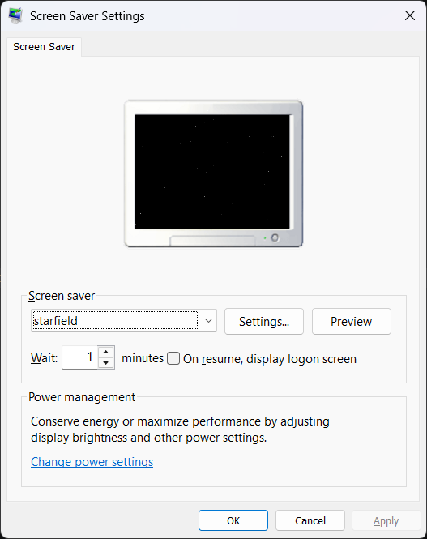

# Starfield Screen Saver
A reimplementation of the Starfield screen saver in SDL3.

## Building this project on Windows with MSYS2

Prerequisites
-------------
MSYS2 installed with the following packages:

    pacman -S mingw-w64-x86_64-cmake mingw-w64-x86_64-make mingw-w64-x86_64-sdl3

First-time build
-----------------
    mkdir build && cd build
    cmake -G "MinGW Makefiles" ..
    mingw32-make

Installing
-----------------
Rename the binary's extension to .scr and copy it to the Windows directory.

